# API

## COMMON INFO
### URL
https://localhost:8443...

### STATUS
CODE | STATUS
---  | ---
200  | OK
201  | CREATED
304  | NOT MODIFIED
400  | BAD REQUEST
401  | UNAUTHORIZED - WRONG PASSWORD
404  | NOT FOUND

### LOGIN 
...URL              | METHOD    | INPUT                   | OUTPUT 
---                 | ---       | ---                     | --- 
/api/logIn          | GET       | None                    | User
/api/logOut         | GET       | HttpSession             | Boolean

#### EXAMPLE
[GET] */api/logIn*  

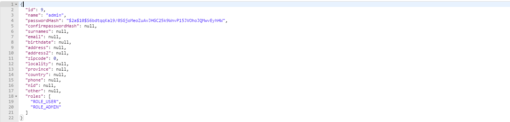

[GET] */api/logOut* 
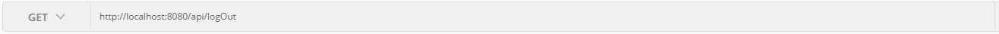
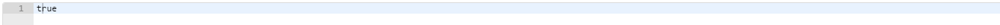

### PRODUCTS
...URL              | METHOD    | INPUT                   | OUTPUT 
---                 | ---       | ---                     | --- 
/api/products/      | GET       | None                    | List of [Product]
/api/products/{id}  | GET       | Product.Id              | Product
/api/products/{name}| GET       | Product.Name            | Product
/api/products/      | POST      | Product                 | Product 
/api/products/{id}  | PUT       | Product.Id, Product     | Product 
/api/products/{id}  | DELETE    | Product.Id              | Product 

[GET] */api/products/*      
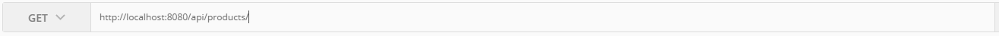
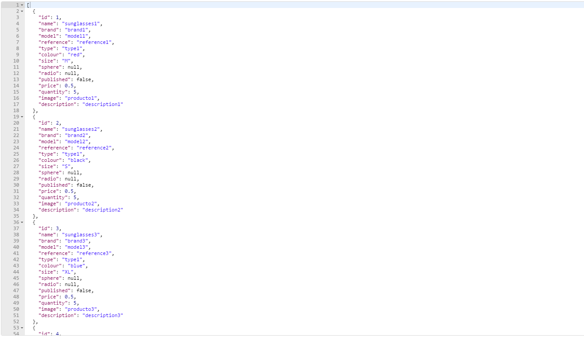

[GET] */api/products/{id}*  
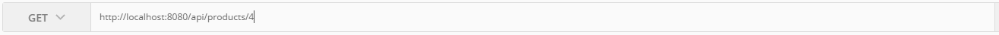
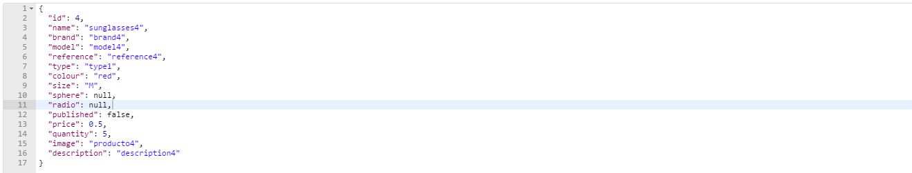

[GET] */api/products/{name}*      
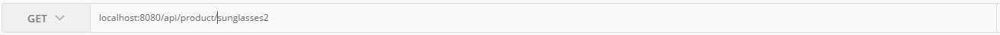
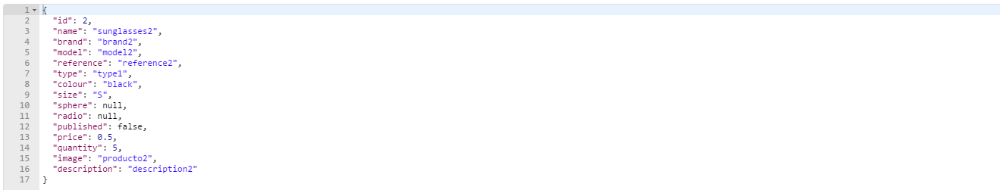

[POST] */api/products/*      
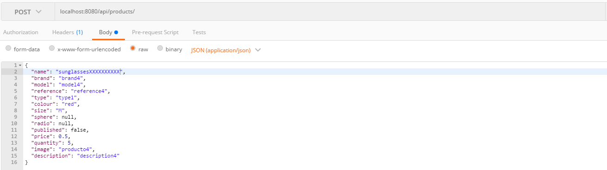
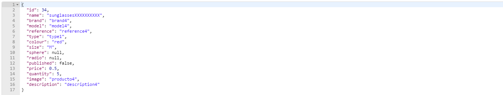

[PUT] */api/products/{id}*      
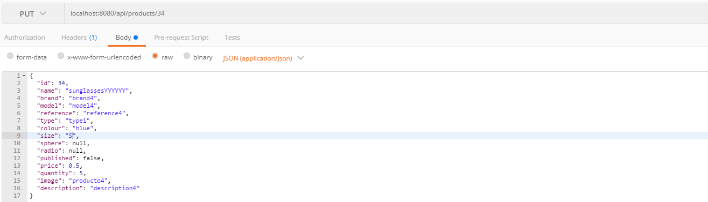
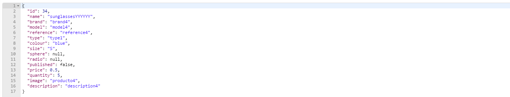

[DELETE] */api/products/{id}*      
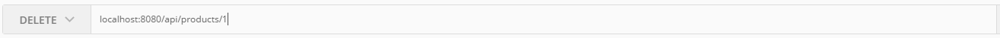
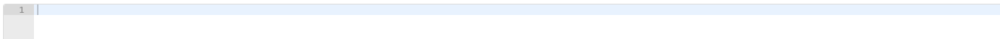

### USERS
...URL              | METHOD    | INPUT                   | OUTPUT 
---                 | ---       | ---                     | --- 
/api/users/         | GET       | None                    | List of [User] 
/api/users/{id}     | GET       | User.Id                 | User
/api/users/         | POST      | User                    | User
/api/users/{id}     | PUT       | User.Id, Product        | User 
/api/users/{id}     | DELETE    | User.Id                 | User 

[GET] */api/users/*      

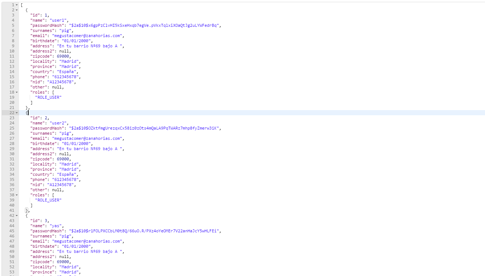

[GET] */api/users/{id}*
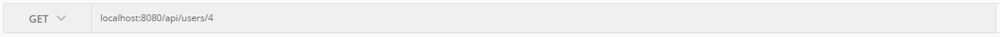
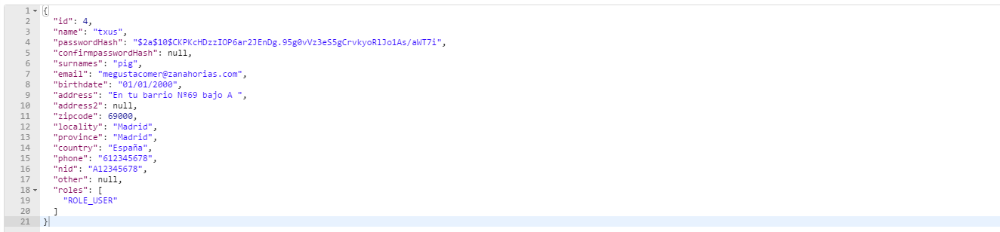

[POST] */api/users/*


[PUT] */api/users/{id}*
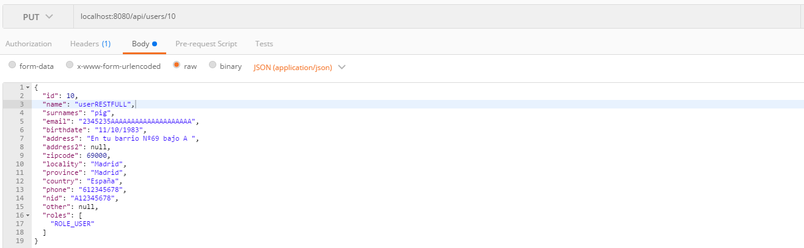
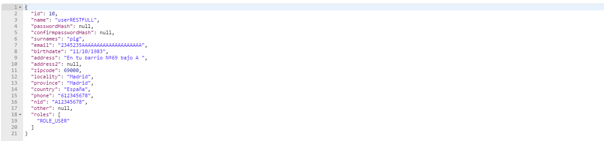

[DELETE] */api/users/{id}*
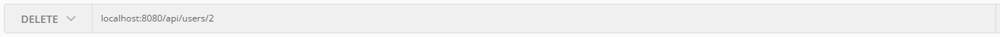
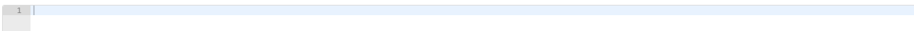

### ORDERS [Order = OrderSummary]
...URL              | METHOD    | INPUT                   | OUTPUT 
---                 | ---       | ---                     | --- 
/api/carts/         | GET       | None                    | List of [Cart]
/api/carts/{id}     | GET       | Cart.Id                 | Item of Cart
/api/carts/         | POST      | Cart                    | Cart
/api/orders/        | GET       | None                    | List of [Order]               
/api/orders/{id}    | GET       | Order.Id                | Order     
/api/orders/        | POST      | Order                   | Order                     
/api/orders/{id}    | PUT       | Order.Id, Order         | Order    
/api/orders/{id}    | DELETE    | Order.Id                | Order    

[GET] */api/carts/*

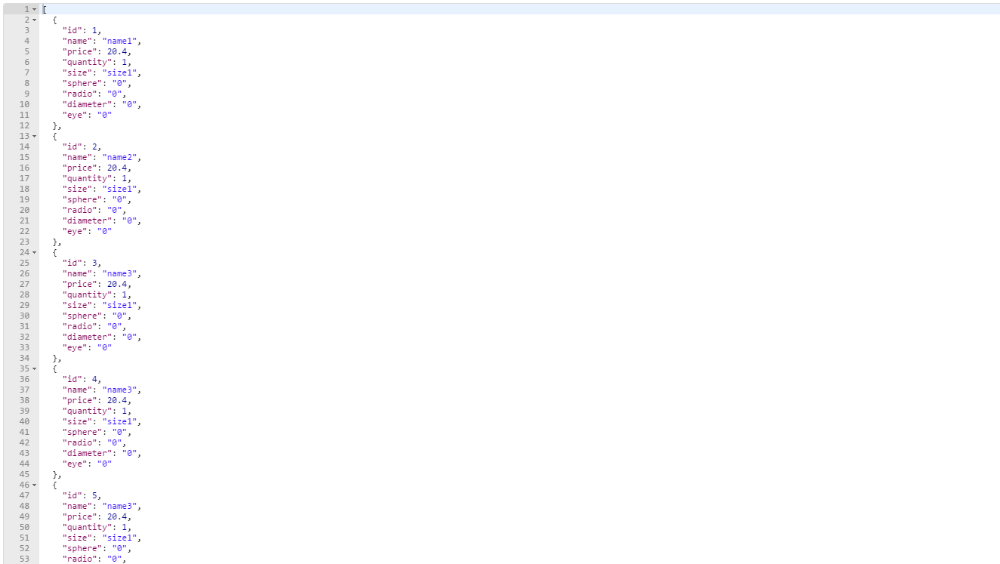

[GET] */api/carts/{id}*

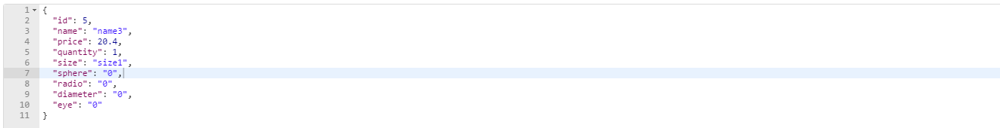

[POST] */api/carts/*
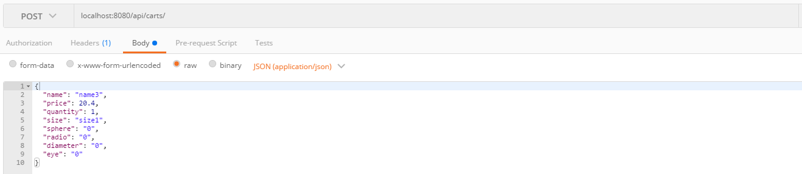
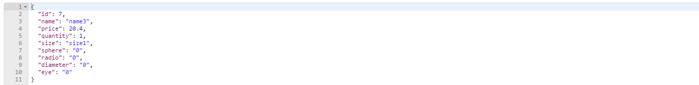

[GET] */api/orders/*
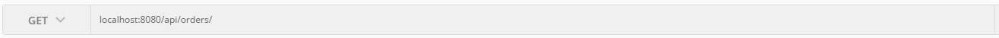
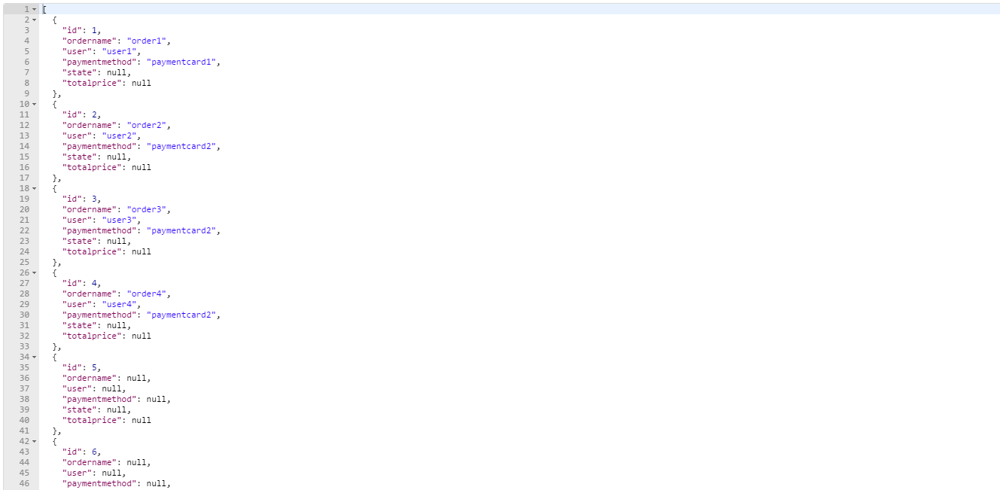

[GET] */api/orders/{id}*
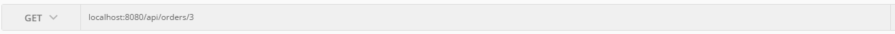
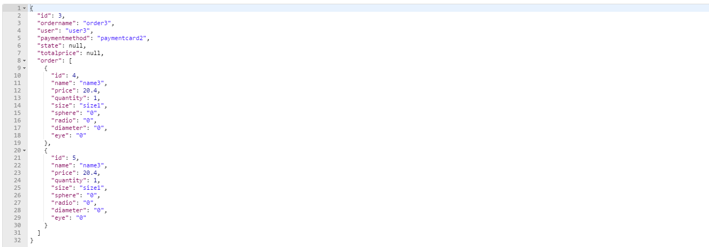

[POST] */api/orders/*
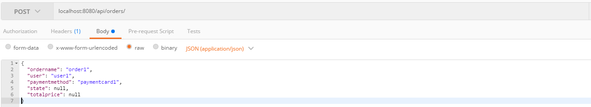
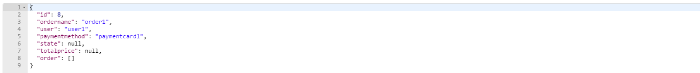

[PUT] */api/orders/{id}*
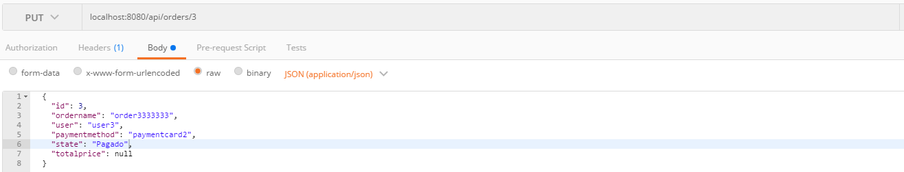
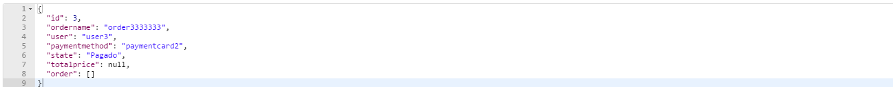

[DELETE] */api/orders/{id}*
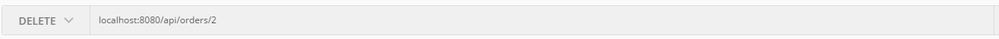
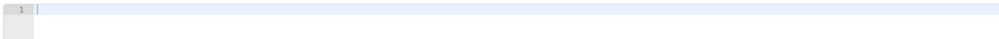

#### Example of Product
https://localhost:8443/api/products/15
```json
{
  "id": 15,
  "name": "accesory15",
  "brand": "brand15",
  "model": "model15",
  "reference": "reference15",
  "type": "type3",
  "colour": null,
  "size": null,
  "sphere": null,
  "radio": null,
  "published": false,
  "price": 0.5,
  "quantity": 5,
  "image": "producto15",
  "description": "description15"
}
```

#### Example of User
https://localhost:8443/api/users/2
``` json
{
  "id": 2,
  "name": "user2",
  "passwordHash": "$2a$10$cnbjIHCE.X8kAndSenKLbuRGSpcnMP3Hh4kqm8GEAlpeVW2bADhR6",
  "confirmpasswordHash": null,
  "surnames": "pig",
  "email": "megustacomer@zanahorias.com",
  "birthdate": "01/01/2000",
  "address": "En tu barrio Nº69 bajo A ",
  "address2": null,
  "zipcode": 69000,
  "locality": "Madrid",
  "province": "Madrid",
  "country": "España",
  "phone": "612345678",
  "nid": "A12345678",
  "other": null,
  "roles": [
    "ROLE_USER"
  ]
}
```

#### Example of Order
https://localhost:8443/api/orders/1
``` json
{
  "id": 1,
  "ordername": "order1",
  "user": "user1",
  "paymentmethod": "paymentcard1",
  "order": [
    {
      "id": 1,
      "name": "name1",
      "price": 20.4,
      "quantity": 1,
      "size": "size1",
      "sphere": "0",
      "radio": "0",
      "diameter": "0",
      "eye": "0"
    }
  ]
}
```
