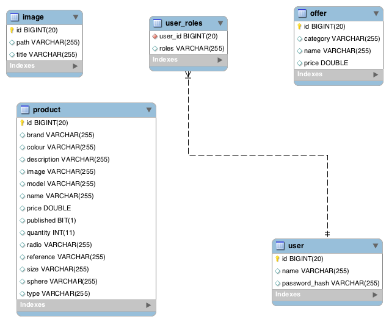

# DAW2017 - Repositorio para la asignatura de Desarrollo de Aplicaciones Web - 2017.

## Nombre del Proyecto
### VisionLynx

## Descripción
Aplicación web de venta de productos de óptica.

### Funcionalidad Pública
  1. Venta de Productos.
  2. Registro de usuarios.
  3. Realizar pedido sin login.
  
### Funcionalidad Privada

#### Administador
  1. Administración de Productos (Añadir/Quitar Productos, Añadir ofertas...)
  2. Administración de Usuarios  (Añadir/Quitar Usuarios)

#### Usuarios
  1. Administración de datos personales. 
  2. Crear, Cancelar y Seguimiento de Pedidos.
   

## Entidades
  - <b>USUARIO</b>: Tipo | Datos de Usuarios.
    - Si es administrador podrá editar el contenido.
    - Puede tener un carrito de la compra y productos de seguimiento.
  
  - <b>PRODUCTO</b>: Tipo | Precio | Modelo | Marca | Stock | Detalles
  
  - <b>CATEGORIA PRODUCTO</b>: Especificación de los TIPOS de PRODUCTO
    - Lentillas, Montura graduadas, Líquido de lentillas, Monturas de sol, Lentes, Limpia cristales...
    
  - <b>PEDIDO</b>: PRODUCTO(S) | USUARIO | Precio final | Dirección de envío | Dirección de facturación | Seguimiento del pedido
  
  - <b>OFERTAS</b>: PRODUCTO(S) | Rebajas | Rebaja acumulable en función del número de pedidos.
  
## INTEGRANTES
  - Thais Méndez Otero            t.mendez@alumnos.urjc.es        ThaisM
  - Yasmina Leranca Domínguez     y.leranca@alumnos.urjc.es       yasminalrc
  - Dina El Gueddari              d.elgueddari@alumnos.urjc.es    dinaelgueddari
  - Juan Jesús Blanco Bautista    jj.blanco@alumnos.urjc.es       jjblancob

## Diagrama de Entidad/Relación

