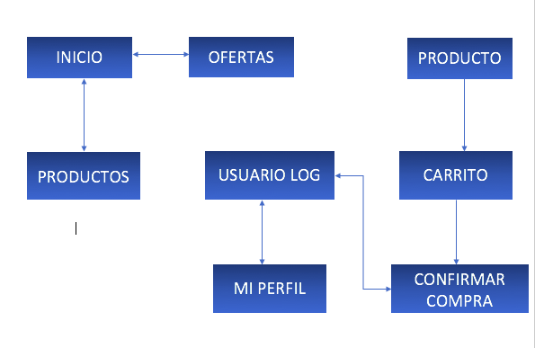
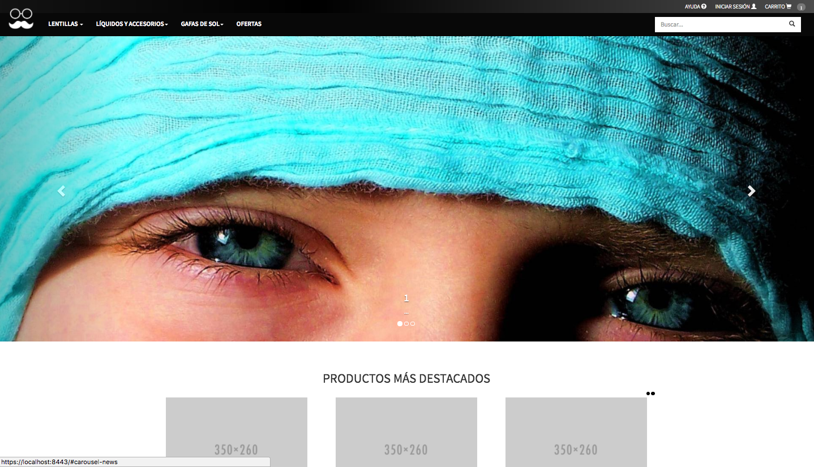
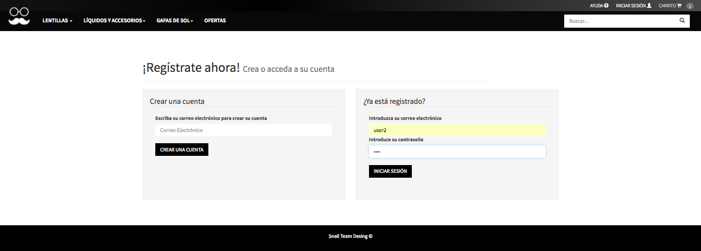
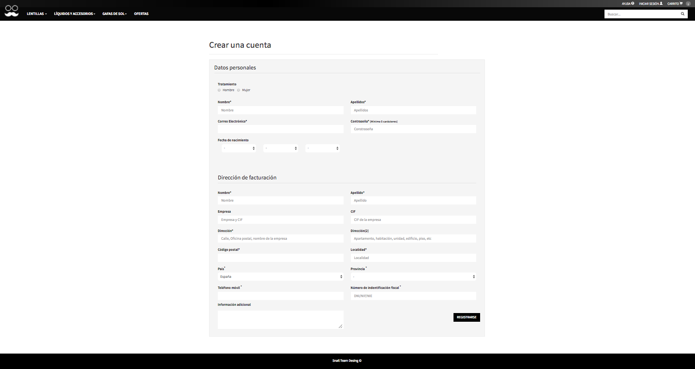
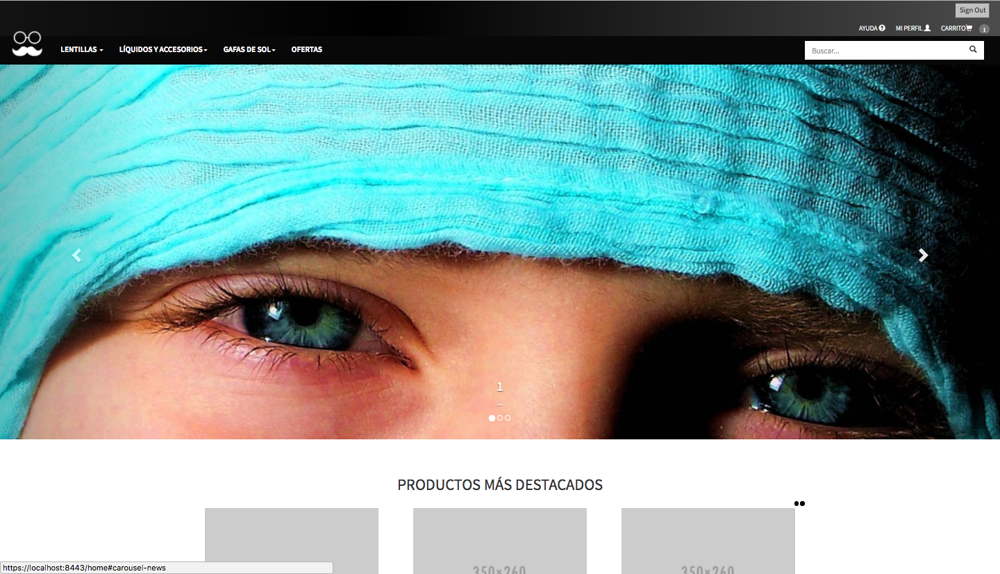
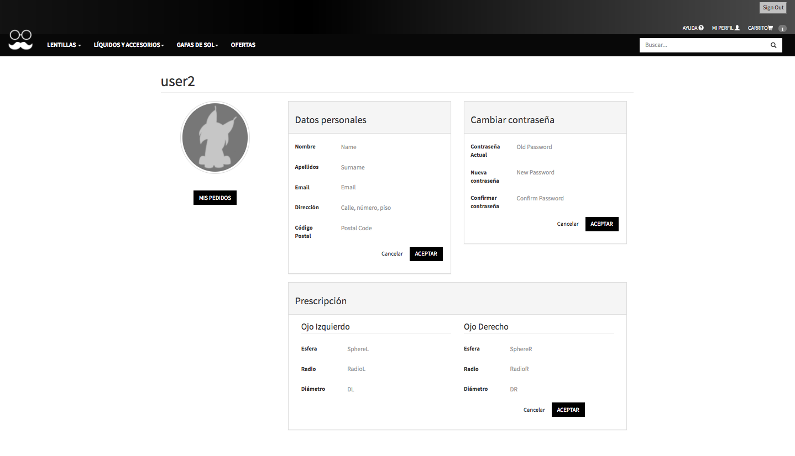
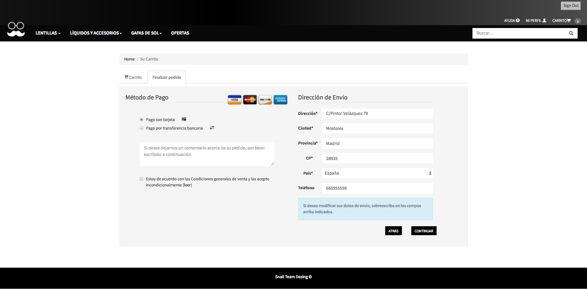
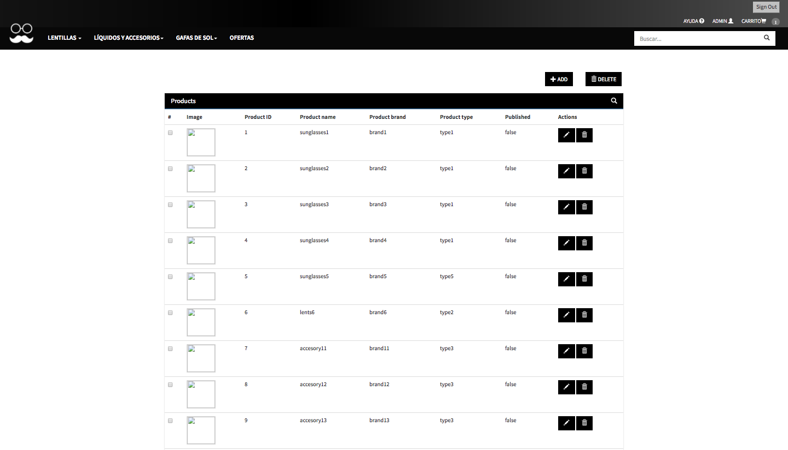
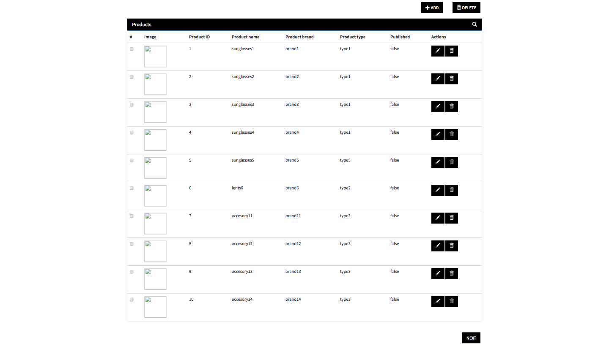
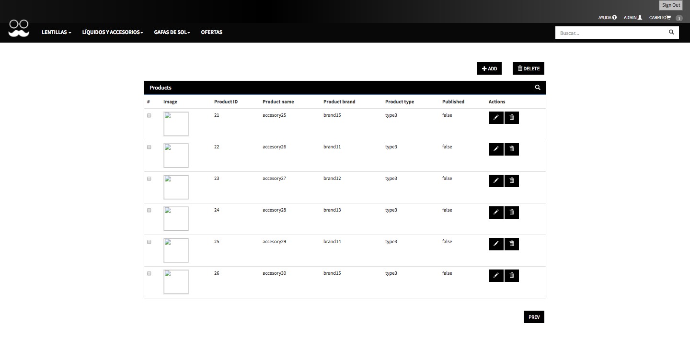

# DAW2017 - Repositorio para la asignatura de Desarrollo de Aplicaciones Web - 2017.

## Nombre del Proyecto
### VisionLynx

## Descripción
Aplicación web de venta de productos de óptica.

### Funcionalidad Pública
  1. Venta de Productos.
  2. Registro de usuarios.
  3. Realizar pedido sin login.
  
### Funcionalidad Privada

#### Administador
  1. Administración de Productos (Añadir/Quitar Productos, Añadir ofertas...)
  2. Administración de Usuarios  (Añadir/Quitar Usuarios)

#### Usuarios
  1. Administración de datos personales. 
  2. Crear, Cancelar y Seguimiento de Pedidos.
   

## Entidades
  - <b>USUARIO</b>: Tipo | Datos de Usuarios.
    - Si es administrador podrá editar el contenido.
    - Puede tener un carrito de la compra y productos de seguimiento.
  
  - <b>PRODUCTO</b>: Tipo | Precio | Modelo | Marca | Stock | Detalles
  
  - <b>CATEGORIA PRODUCTO</b>: Especificación de los TIPOS de PRODUCTO
    - Lentillas, Montura graduadas, Líquido de lentillas, Monturas de sol, Lentes, Limpia cristales...
    
  - <b>PEDIDO</b>: PRODUCTO(S) | USUARIO | Precio final | Dirección de envío | Dirección de facturación | Seguimiento del pedido
  
  - <b>OFERTAS</b>: PRODUCTO(S) | Rebajas | Rebaja acumulable en función del número de pedidos.
  
## INTEGRANTES
  - Thais Méndez Otero            t.mendez@alumnos.urjc.es        ThaisM
  - Yasmina Leranca Domínguez     y.leranca@alumnos.urjc.es       yasminalrc
  - Dina El Gueddari              d.elgueddari@alumnos.urjc.es    dinaelgueddari
  - Juan Jesús Blanco Bautista    jj.blanco@alumnos.urjc.es       jjblancob

## DIAGRAMA DE ENTIDAD/RELACIÓN

## DIAGRAMA DE CLASES Y TEMPLATES

## DIAGRAMA DE NAVEGACIÓN

Comenzamos en <index.html>:

Desde aquí podemos registrarnos para acceder con nuestro usuario, o acceder a la página de registro en caso de no tener aún un usuario.

<b>Crear cuenta </b>

Si estamos registrados y nos logueamos con nuestro usuario, entonces la página principal se muestra de la siguiente forma, donde nos redirige a la página de inicio pero como usuario loggeado.

Y si queremos acceder a nuestro perfil, seleccionamos <b>MI PERFIL</b> que se encuentra en la barra de navegación

Se puede acceder a varias funcionalidades, cambiar sus datos de usuario, acceder a las ofertas, mi carrito, etc.

La sección de ofertas es una página pública, cualquier usuario, registrado o no puede acceder a ella.

<b>Ofertas</b> 

Mi carrito también es una sección tanto privada como pública

<b>Mi carrito</b> 

Cerramos sesión para loggearnos como usuario <b>Admin</b>,  cuya página principal es la de index, igual que cualquier usuario, sin embargo, en este caso al ser admin, no aparece en la barra de navegación MI PERFIL, sino <b>ADMIN</b>, que muestra todos los productos de la tienda, así como añadir un producto, borrar un producto, editarlo, etc.

En cada página se muestran 10 productos:

Para añadir un producto a la tienda, seleccionamos el botón <b>add</b>

